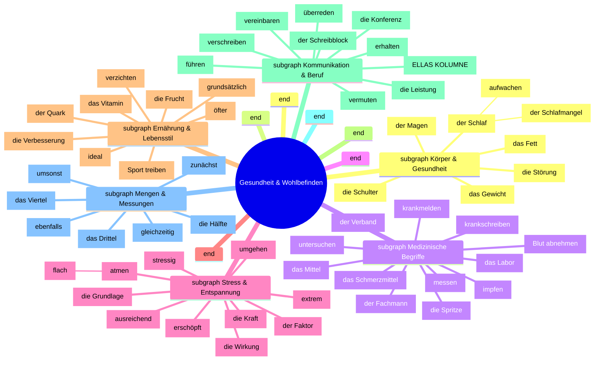
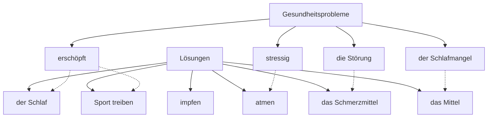
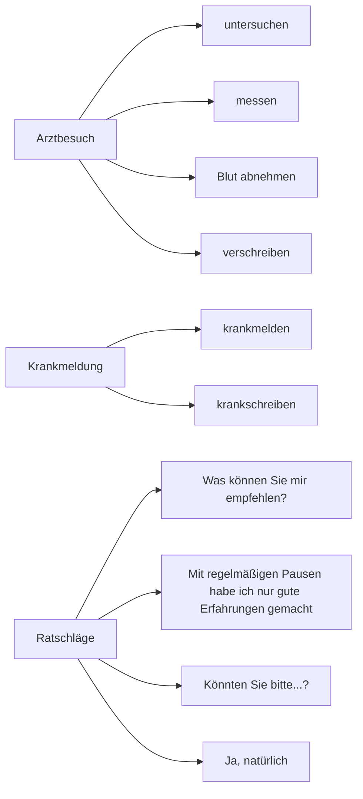
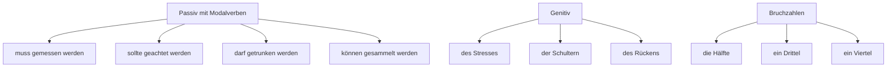

# Lektion 3 - Vokabeln Mind Map

## Thematische Verbindungen der Vokabeln (Thematic Connections of Vocabulary)

## Funktionale Verbindungen (Functional Connections)

### Gesundheitsprobleme & Lösungen

### Kommunikation im Gesundheitsbereich

### Grammatik & Vokabeln Verbindungen

## Vokabeln nach Wortart (Vocabulary by Word Type)

### Substantive (Nouns)
- **Körperteile**: der Magen, die Schulter
- **Gesundheitszustände**: der Schlaf, das Gewicht, die Störung, die Kraft
- **Medizinische Begriffe**: das Schmerzmittel, das Mittel, das Labor, der Verband, die Spritze
- **Personen**: der Fachmann
- **Nahrung**: das Fett, die Frucht, der Quark, das Vitamin
- **Abstrakte Konzepte**: die Wirkung, die Grundlage, der Faktor, die Verbesserung, das Ergebnis, das Wohl
- **Berufliches**: die Konferenz, der Schreibblock, die Leistung, die Einnahme

### Verben (Verbs)
- **Gesundheitsbezogen**: atmen, impfen, untersuchen, messen, abnehmen
- **Kommunikation**: führen, vereinbaren, überreden, vermuten, verschreiben
- **Handlungen**: umgehen, aufwachen, treiben, verzichten, krankmelden, krankschreiben, erhalten, teilnehmen

### Adjektive & Adverbien (Adjectives & Adverbs)
- **Zustandsbeschreibungen**: stressig, erschöpft, extrem, flach
- **Häufigkeit & Zeit**: nachts, öfter, gleichzeitig, zunächst
- **Qualität**: ausreichend, ideal, grundsätzlich
- **Sonstige**: ebenfalls, umsonst

### Mengenangaben (Quantities)
- **Bruchzahlen**: die Hälfte, das Drittel, das Viertel

## Anwendungsbeispiele (Application Examples)

1. **Arztbesuch Szenario**:
   - "Mein **Magen** tut weh. Ich bin sehr **erschöpft**."
   - "Ihr **Gewicht** **muss gemessen werden**. Ich **vermute** Stress als Ursache."
   - "Ich **verschreibe** Ihnen kein **Schmerzmittel**, sondern empfehle ein natürliches **Mittel**."

2. **Gesunde Lebensweise Szenario**:
   - "Weniger **Fett** und mehr **Vitamine** sind wichtig."
   - "**Grundsätzlich** sollte man regelmäßig Sport **treiben**."
   - "Der **Schlaf** ist die **Grundlage** jeder Entspannung."

3. **Büro-Kommunikation Szenario**:
   - "Ich muss mich **krankmelden**. Der Arzt hat mich **krankgeschrieben**."
   - "**Könnten Sie bitte** an der **Konferenz** teilnehmen?"
   - "**Was können Sie mir empfehlen** gegen Kopfschmerzen?"
