```mermaid
timeline
    title Frau Müllers Weg zur Gesundheit
    section Probleme erkennen
        Stress bei der Arbeit : Frau Müller hat einen <span style="color:red;">**stressigen** (stressful)</span> Beruf
        : Sie arbeitet in einem <span style="color:red;">**Labor** (laboratory)</span>
        : <span style="color:red;">**Nachts** (at night)</span> kann sie nicht gut schlafen
        Schlafprobleme : Durch den <span style="color:red;">**Schlafmangel** (lack of sleep)</span> ist sie <span style="color:red;">**extrem** (extremely)</span> müde
        : Sie ist <span style="color:red;">**erschöpft** (exhausted)</span>
        Statistik : <span style="color:orange;">**Die Hälfte** (half)</span> ihrer Kollegen hat ähnliche Probleme
        : <span style="color:orange;">**Ein Drittel** (a third)</span> der Ärzte nimmt Medikamente
        : <span style="color:orange;">**Ein Viertel** (a quarter)</span> hat sich schon <span style="color:red;">**krankgemeldet** (called in sick)</span>
    section Hilfe suchen
        Entscheidung : "Auf meine Gesundheit <span style="color:blue;">**sollte** besser **geachtet werden**</span>"
        : Sie beschließt, einen Termin zu <span style="color:red;">**vereinbaren** (arrange)</span>
        Arztbesuch : Dr. Wirth, ein <span style="color:red;">**Fachmann** (expert)</span>, <span style="color:red;">**untersucht** (examines)</span> sie
        : "Ihr <span style="color:red;">**Gewicht** (weight)</span> <span style="color:blue;">**muss gemessen werden**</span>"
        : "Blut <span style="color:blue;">**muss abgenommen werden**</span>"
        Diagnose : Er <span style="color:red;">**vermutet** (suspects)</span> Stress als Ursache für die <span style="color:red;">**Störungen** (disturbances)</span>
        : <span style="color:purple;">**"Was können Sie mir empfehlen?"**</span>
        : "Die <span style="color:red;">**Wirkung** (effect)</span> <span style="color:green;">**des Stresses** (of the stress)</span> ist sehr stark"
        : "Die Gesundheit <span style="color:green;">**der Schultern** (of the shoulders)</span> leidet auch"
    section Empfehlungen
        Rat des Arztes : <span style="color:purple;">**"Könnten Sie bitte** einige Entspannungsübungen ausprobieren?</span>
        : <span style="color:purple;">**"Ja, natürlich"**</span>
        : Er <span style="color:red;">**verschreibt** (prescribes)</span> kein <span style="color:red;">**Schmerzmittel** (painkiller)</span>
        Natürliche Mittel : Er empfiehlt ein natürliches <span style="color:red;">**Mittel** (remedy)</span>
        : Zum <span style="color:red;">**Wohl** (well-being)</span> ihrer Gesundheit
        : <span style="color:red;">**Ausreichend** (sufficient)</span> Bewegung
        : <span style="color:red;">**Grundsätzlich** (as a matter of principle)</span> <span style="color:blue;">**darf** nicht zu viel Kaffee **getrunken werden**</span>
    section Änderungen im Lebensstil
        Ernährung : "Weniger <span style="color:red;">**Fett** (fat)</span> und mehr <span style="color:red;">**Vitamine** (vitamins)</span>"
        : <span style="color:blue;">**Müssen** in meinen Speiseplan **eingebaut werden**</span>
        : <span style="color:red;">**Quark** (quark)</span> mit <span style="color:red;">**Früchten** (fruits)</span> zum Frühstück
        Atmung : Richtig <span style="color:red;">**atmen** (breathe)</span> lernen
        : Nicht <span style="color:red;">**flach** (shallow)</span> atmen
        : Die <span style="color:red;">**Kraft** (strength)</span> der richtigen Atmung nutzen
        Stressbewältigung : Besser mit Stress <span style="color:red;">**umgehen** (deal with)</span>
        : <span style="color:red;">**Öfter** (more often)</span> lachen
        Schlaf : Auf regelmäßigen <span style="color:red;">**Schlaf** (sleep)</span> achten
        : Er ist die <span style="color:red;">**Grundlage** (foundation)</span> jeder Entspannung
    section Verbesserungen
        Besserer Schlaf : Sie <span style="color:red;">**wacht** nicht mehr so oft **auf** (wakes up)</span>
        : Die <span style="color:red;">**Verbesserung** (improvement)</span> ist deutlich
        : Sie kann besser mit den <span style="color:red;">**Faktoren** (factors)</span> umgehen
        Krankenkasse : Sie kann <span style="color:red;">**ebenfalls** (also)</span> Hilfe <span style="color:red;">**erhalten** (receive)</span>
        : Viele <span style="color:red;">**Leistungen** (services)</span>
        : <span style="color:purple;">**"Sie können umsonst (for free) an Gesundheitskursen teilnehmen!"**</span>
        Gesundheitskonferenz : In einer <span style="color:red;">**Konferenz** (conference)</span> über Gesundheit
        : Die <span style="color:red;">**Einnahme** (intake)</span> von Medikamenten ist nicht immer die beste Lösung
        : Sport <span style="color:red;">**treiben** (to do)</span> ist besser
        : Auf Tabletten <span style="color:red;">**verzichten** (give up)</span>
    section Weitergabe des Wissens
        Kollegin beraten : "Ich kann nicht <span style="color:red;">**gleichzeitig** (simultaneously)</span> an mehreren Projekten arbeiten"
        : <span style="color:purple;">**"Was können Sie mir empfehlen?"**</span>
        : <span style="color:purple;">**"Mit regelmäßigen Pausen habe ich nur gute Erfahrungen gemacht"**</span>
        : <span style="color:red;">**Zunächst** (initially)</span> kleine Übungen machen
        : Den Kopf zur <span style="color:red;">**Schulter** (shoulder)</span> neigen
        Büroorganisation : Der <span style="color:red;">**Abfalleimer** (trash can)</span> <span style="color:blue;">**muss geleert werden**</span>
        : Neue <span style="color:red;">**Verbände** (bandages)</span> und <span style="color:red;">**Spritzen** (syringes)</span> <span style="color:blue;">**müssen bestellt werden**</span>
        : <span style="color:purple;">**"Könnten Sie bitte** ihr Bescheid geben?</span>
        : <span style="color:purple;">**"Ja, natürlich"**</span>
        Ellas Kolumne : Sie hat ihre Kollegin <span style="color:red;">**überredet** (persuaded)</span>
        : <span style="color:red;">**ELLAS KOLUMNE** (ELLA'S COLUMN)</span> ist sehr beliebt
        : <span style="color:purple;">**"Ich sollte mich auch regelmäßig impfen lassen"** (get vaccinated)</span>
```

# Lektion 3 - Interaktive Zeitleiste

## Frau Müllers Weg zur Gesundheit: Eine chronologische Darstellung

Diese Zeitleiste zeigt die wichtigsten Ereignisse in Frau Müllers Geschichte und hilft Ihnen, die Vokabeln und Grammatik in einem zeitlichen Kontext zu verstehen.

## Farbkodierung (Color Coding):
- **Rot/Red**: Vokabeln/Vocabulary
- **Blau/Blue**: Passiv mit Modalverben/Passive with modal verbs
- **Grün/Green**: Genitiv/Genitive case
- **Orange**: Bruchzahlen/Fractions
- **Lila/Purple**: Kommunikationsphrasen/Communication phrases

---

---

## Interaktive Elemente für jede Phase der Zeitleiste

### 1. Probleme erkennen

**Schlüsselvokabeln:**
- **stressig** (stressful)
- **Labor** (laboratory)
- **nachts** (at night)
- **Schlafmangel** (lack of sleep)
- **extrem** (extremely)
- **erschöpft** (exhausted)

**Grammatikfokus:** Bruchzahlen (Fractions)
- **Die Hälfte** (half) ihrer Kollegen
- **Ein Drittel** (a third) der Ärzte
- **Ein Viertel** (a quarter) der Abteilung

**Diskussionsfragen:**
1. Welche Stresssymptome haben Sie schon erlebt?
2. Wie viele Menschen in Ihrem Umfeld leiden unter Stress?
3. Wie wirkt sich Schlafmangel auf Ihre Gesundheit aus?

### 2. Hilfe suchen

**Schlüsselvokabeln:**
- **vereinbaren** (arrange)
- **Fachmann** (expert)
- **untersuchen** (examine)
- **Gewicht** (weight)
- **vermuten** (suspect)
- **Störung** (disturbance)
- **Wirkung** (effect)

**Grammatikfokus:** 
- Passiv mit Modalverben: **sollte geachtet werden, muss gemessen werden**
- Genitiv: **des Stresses, der Schultern**

**Übung:** Formulieren Sie Sätze mit Passiv und Modalverben über einen Arztbesuch.
Beispiel: "Der Blutdruck **muss gemessen werden**."

### 3. Empfehlungen

**Schlüsselvokabeln:**
- **verschreiben** (prescribe)
- **Schmerzmittel** (painkiller)
- **Mittel** (remedy)
- **Wohl** (well-being)
- **ausreichend** (sufficient)
- **grundsätzlich** (as a matter of principle)

**Grammatikfokus:** 
- Kommunikationsphrasen: **"Könnten Sie bitte...?", "Ja, natürlich"**
- Passiv mit Modalverben: **darf nicht getrunken werden**

**Rollenspiel:** Spielen Sie einen Dialog zwischen Arzt und Patient mit den Kommunikationsphrasen.

### 4. Änderungen im Lebensstil

**Schlüsselvokabeln:**
- **Fett** (fat)
- **Vitamine** (vitamins)
- **Quark** (quark)
- **Früchte** (fruits)
- **atmen** (breathe)
- **flach** (shallow)
- **Kraft** (strength)
- **umgehen** (deal with)
- **öfter** (more often)
- **Schlaf** (sleep)
- **Grundlage** (foundation)

**Grammatikfokus:** Passiv mit Modalverben: **müssen eingebaut werden**

**Kreative Aufgabe:** Erstellen Sie einen Wochenplan für gesunde Gewohnheiten mit den gelernten Vokabeln.

### 5. Verbesserungen

**Schlüsselvokabeln:**
- **aufwachen** (wake up)
- **Verbesserung** (improvement)
- **Faktoren** (factors)
- **ebenfalls** (also)
- **erhalten** (receive)
- **Leistungen** (services)
- **Konferenz** (conference)
- **Einnahme** (intake)
- **treiben** (to do)
- **verzichten** (give up)

**Grammatikfokus:** Kommunikationsphrasen: **"Sie können umsonst an Gesundheitskursen teilnehmen!"**

**Schreibübung:** Beschreiben Sie Verbesserungen in Ihrem eigenen Leben mit den gelernten Vokabeln.

### 6. Weitergabe des Wissens

**Schlüsselvokabeln:**
- **gleichzeitig** (simultaneously)
- **zunächst** (initially)
- **Schulter** (shoulder)
- **Abfalleimer** (trash can)
- **Verbände** (bandages)
- **Spritzen** (syringes)
- **überreden** (persuade)
- **ELLAS KOLUMNE** (ELLA'S COLUMN)

**Grammatikfokus:** 
- Kommunikationsphrasen: **"Was können Sie mir empfehlen?", "Mit regelmäßigen Pausen habe ich nur gute Erfahrungen gemacht"**
- Passiv mit Modalverben: **muss geleert werden, müssen bestellt werden**

**Gruppenaktivität:** Geben Sie in Kleingruppen Ratschläge zu verschiedenen Gesundheitsthemen mit den gelernten Kommunikationsphrasen.

---

## Anleitung zur Verwendung der Zeitleiste:

1. **Chronologisches Verständnis**: Folgen Sie der Zeitleiste, um die Geschichte von Frau Müller in chronologischer Reihenfolge zu verstehen.

2. **Fokus auf Phasen**: Konzentrieren Sie sich auf eine Phase nach der anderen und lernen Sie die zugehörigen Vokabeln und Grammatikstrukturen.

3. **Interaktive Übungen**: Nutzen Sie die vorgeschlagenen Übungen, Diskussionsfragen und Aktivitäten für jede Phase.

4. **Eigene Zeitleiste erstellen**: Erstellen Sie eine persönliche Zeitleiste zu einem Gesundheitsthema mit den gelernten Vokabeln und Grammatikstrukturen.

5. **Verbindungen herstellen**: Achten Sie auf die Verbindungen zwischen den verschiedenen Phasen und wie sich die Geschichte entwickelt.
