# German Learning Connections 🔄

This file serves as a central hub for connecting concepts across your German learning materials, with tags for easy reference and navigation.

## Table of Contents
- [Grammar Connections](#grammar-connections)
- [Vocabulary Themes](#vocabulary-themes)
- [Cross-Lektion Connections](#cross-lektion-connections)
- [Learning Pathways](#learning-pathways)
- [Tag Index](#tag-index)

## Grammar Connections

### Grammar Progression Map

```mermaid
graph TD
    A1[A1 Level] --> A2[A2 Level] --> B1[B1.1 Level]
    
    A1 --> A1a[Basic Sentence Structure]
    A1 --> A1b[Present Tense]
    A1 --> A1c[Basic Pronouns]
    A1 --> A1d[Basic Time Expressions]
    A1 --> A1e[Basic Numbers]
    
    A2 --> A2a[Complex Sentences with weil, dass, wenn]
    A2 --> A2b[Perfect Tense haben/sein + PP]
    A2 --> A2c[Cases Nom/Akk/Dat]
    A2 --> A2d[Repeated Events with wenn]
    A2 --> A2e[Percentages]
    A2 --> A2f[Passive Voice wird + PP]
    A2 --> A2g[Possessive Pronouns]
    
    B1 --> B1a[Subordinate Clauses with obwohl, trotzdem]
    B1 --> B1b[Präteritum Simple Past]
    B1 --> B1c[Relativpronomen]
    B1 --> B1d[One-time Past Events with als]
    B1 --> B1e[Plusquamperfekt had done]
    B1 --> B1f[Passive with Modal Verbs]
    B1 --> B1g[Genitive Case]
    B1 --> B1h[Fractions]
    B1 --> B1i[Gradpartikeln]
    
    style A1 fill:#f9d5e5,stroke:#333
    style A2 fill:#d5e8f9,stroke:#333
    style B1 fill:#e8f9d5,stroke:#333
```

### Detailed Grammar Concepts

#### Konjunktion: obwohl (although) 🔄
#Lektion2 #B1.1 #Conjunction #SubordinateClause

- **What it is**: Means "although" or "even though" - expresses contrast
- **How it works**: Sends verb to the end of the clause
- **Example**: `Tim spielt Fußball, obwohl es regnet.`
- **Connected to**: 
  - A1: Basic sentence structure
  - A2: Other subordinating conjunctions (weil, dass, wenn)
  - B1.1: trotzdem (nevertheless)

→ Full details: [Lektion#2-Grammar-Memorization.md](Lektion#2-Grammar-Memorization.md)

#### Präteritum (Simple Past) ⏮️
#Lektion1 #B1.1 #Verb #PastTense

- **What it is**: Simple past tense in German (one-word past tense)
- **When to use it**: Primarily in written German (except for sein, haben, modal verbs)
- **Example**: `35 Jahre lang spielte Manfred Schulze jede Woche Lotto.`
- **Connected to**:
  - A1: Present tense
  - A2: Perfect tense (haben/sein + past participle)
  - B1.1: Plusquamperfekt

→ Full details: [Lektion#1-Grammar-Memorization.md](Lektion#1-Grammar-Memorization.md)

#### Konjunktion: als (when) ⏰
#Lektion1 #B1.1 #Conjunction #TimeExpression

- **What it is**: "When" for ONE-TIME events in the past
- **How it works**: Sends verb to the end of the clause
- **Example**: `Als ich 5 Jahre alt war, hatte ich Angst vor Hunden.`
- **Connected to**:
  - A1: Basic time expressions
  - A2: wenn (for repeated events)
  - B1.1: Präteritum

→ Full details: [Lektion#1-Grammar-Memorization.md](Lektion#1-Grammar-Memorization.md)

#### Plusquamperfekt (Past Perfect) 🔙
#Lektion1 #B1.1 #Verb #PastTense

- **What it is**: Past of the past - for events before another past event
- **How it works**: hatte/war (in past tense) + past participle
- **Example**: `Ich hatte Bauchschmerzen, weil ich zu viele Kirschen gegessen hatte.`
- **Connected to**:
  - A1: Present tense
  - A2: Perfect tense
  - B1.1: Präteritum

→ Full details: [Lektion#1-Grammar-Memorization.md](Lektion#1-Grammar-Memorization.md)

#### Gradpartikeln (Degree Particles) 📊
#Lektion2 #B1.1 #Adverb #Intensity

- **What they are**: Words that show HOW MUCH you like or don't like something
- **Examples**: echt, total, ziemlich, nicht so, gar nicht
- **Example sentence**: `Der neue Superhelden-Film ist echt cool!`
- **Connected to**:
  - A1: Basic adjectives
  - A2: Comparative forms
  - B1.1: Expressing opinions

→ Full details: [Lektion#2-Grammar-Memorization.md](Lektion#2-Grammar-Memorization.md)

#### Relativpronomen (Relative Pronouns) 🔍
#Lektion2 #B1.1 #Pronoun #SubordinateClause

- **What they are**: Words like "who" or "that" to describe people/things
- **Forms**: der/das/die (nom), den/das/die (acc), dem/dem/der (dat)
- **Example**: `Das ist der Junge, der Fußball spielt.`
- **Connected to**:
  - A1: Personal pronouns
  - A2: Cases (Nom/Akk/Dat)
  - B1.1: Complex sentences

→ Full details: [Lektion#2-Grammar-Memorization.md](Lektion#2-Grammar-Memorization.md)

#### Passiv mit Modalverben (Passive with Modal Verbs) 🔄
#Lektion3 #B1.1 #Verb #PassiveVoice

- **What it is**: Shows something should/must/can be done without saying who does it
- **How it works**: Modal verb in position 2, past participle + werden at end
- **Example**: `Das Zimmer muss jeden Tag aufgeräumt werden.`
- **Connected to**:
  - A1: Basic verbs
  - A2: Passive voice (wird + PP)
  - B1.1: Modal verbs

→ Full details: [Lektion#3-Grammar-Memorization.md](Lektion#3-Grammar-Memorization.md)

#### Genitiv (Genitive Case) 📊
#Lektion3 #B1.1 #Case #Possession

- **What it is**: Shows possession or belonging (German equivalent of 's or "of")
- **Forms**: des/des/der/der + often -s/-es ending for masculine/neuter
- **Example**: `Das ist das Auto meines Vaters.`
- **Connected to**:
  - A1: Basic possessives (mein, dein)
  - A2: Possessive pronouns
  - B1.1: Complex noun phrases

→ Full details: [Lektion#3-Grammar-Memorization.md](Lektion#3-Grammar-Memorization.md)

#### Bruchzahlen (Fractions) 🔢
#Lektion3 #B1.1 #Numbers #Quantity

- **What they are**: Words for parts of a whole (half, third, quarter)
- **Forms**: die Hälfte, ein Drittel, ein Viertel, etc.
- **Example**: `Die Hälfte unserer Gruppe treibt regelmäßig Sport.`
- **Connected to**:
  - A1: Basic numbers
  - A2: Percentages
  - B1.1: Statistics expressions

→ Full details: [Lektion#3-Grammar-Memorization.md](Lektion#3-Grammar-Memorization.md)

## Vocabulary Themes

### Experiences & Events
#Theme #Nouns

- das Erlebnis, -se #Lektion1 #Noun #Experience
- die Überraschung, -en #Lektion1 #Noun #Emotion
- der Gewinn, -e #Lektion1 #Noun #Achievement
- die Meldung, -en #Lektion1 #Noun #Communication
- die Überschrift, -en #Lektion1 #Noun #Communication
- der Mut (Sg.) #Lektion1 #Noun #Emotion
- der Ärger (Sg.) #Lektion1 #Noun #Emotion

→ Source: [Lektion#1-Notion-Memorization.md](Lektion#1-Notion-Memorization.md)

### Travel & Movement
#Theme #Verbs #Nouns

- das Mittelmeer (Sg.) #Lektion1 #Noun #Geography
- steigen (in) #Lektion1 #Verb #Movement
- erreichen #Lektion1 #Verb #Achievement
- fliehen #Lektion1 #Verb #Movement
- verschwinden #Lektion1 #Verb #Movement
- folgen #Lektion1 #Verb #Movement

→ Source: [Lektion#1-Notion-Memorization.md](Lektion#1-Notion-Memorization.md)

### States & Conditions
#Theme #Adjectives

- weg sein #Lektion1 #Verb #State
- verrückt #Lektion1 #Adjective #Description
- mutig #Lektion1 #Adjective #Character
- tief #Lektion1 #Adjective #Description
- einig #Lektion1 #Adjective #Agreement
- betrunken #Lektion1 #Adjective #State
- aufregend #Lektion1 #Adjective #Emotion
- witzig #Lektion1 #Adjective #Character
- verliebt sein #Lektion1 #Verb #Emotion

→ Source: [Lektion#1-Notion-Memorization.md](Lektion#1-Notion-Memorization.md)

### Health & Body
#Theme #Nouns #MedicalTerms

- der Magen, - #Lektion3 #Noun #BodyPart
- das Mittel, - #Lektion3 #Noun #Medicine
- der Schlaf (Sg.) #Lektion3 #Noun #BodyFunction
- der Faktor, -en #Lektion3 #Noun #General
- die Grundlage, -n #Lektion3 #Noun #General
- das Fett, -e #Lektion3 #Noun #Nutrition
- die Wirkung, -en #Lektion3 #Noun #Effect
- die Kraft, -e #Lektion3 #Noun #BodyFunction
- das Ergebnis, -se #Lektion3 #Noun #General
- der Mangel, - #Lektion3 #Noun #Deficiency
- das Schmerzmittel, - #Lektion3 #Noun #Medicine
- die Schulter, -n #Lektion3 #Noun #BodyPart

→ Source: [Lektion#3-Notion-Memorization.md](Lektion#3-Notion-Memorization.md)

### Medical Actions
#Theme #Verbs #MedicalTerms

- achten (hat geachtet) #Lektion3 #Verb #Attention
- messen (hat gemessen) #Lektion3 #Verb #MedicalAction
- ab-nehmen (hat abgenommen) #Lektion3 #Verb #MedicalAction
- untersuchen (hat untersucht) #Lektion3 #Verb #MedicalAction
- vermuten (hat vermutet) #Lektion3 #Verb #Thinking
- verschreiben (hat verschrieben) #Lektion3 #Verb #MedicalAction
- impfen (hat geimpft) #Lektion3 #Verb #MedicalAction
- krank-melden (hat krankgemeldet) #Lektion3 #Verb #WorkRelated
- krankschreiben (hat krankgeschrieben) #Lektion3 #Verb #MedicalAction

→ Source: [Lektion#3-Notion-Memorization.md](Lektion#3-Notion-Memorization.md)

### Fractions & Measurements
#Theme #Numbers

- die Hälfte, -n #Lektion3 #Noun #Fraction
- das Viertel, - #Lektion3 #Noun #Fraction
- das Drittel, - #Lektion3 #Noun #Fraction

→ Source: [Lektion#3-Notion-Memorization.md](Lektion#3-Notion-Memorization.md)

## Cross-Lektion Connections

### Grammar Concepts Across Lektionen

| Grammar Concept | Lektion 1 | Lektion 2 | Lektion 3 |
|-----------------|-----------|-----------|-----------|
| Conjunctions | als (when - one-time) | obwohl (although) | - |
| Past Tenses | Präteritum, Plusquamperfekt | - | - |
| Pronouns | - | Relativpronomen | - |
| Cases | - | - | Genitiv |
| Passive Voice | - | - | Passiv mit Modalverben |
| Modifiers | - | Gradpartikeln | - |
| Numbers | - | - | Bruchzahlen (Fractions) |

### Vocabulary Themes Across Lektionen

| Theme | Lektion 1 | Lektion 2 | Lektion 3 |
|-------|-----------|-----------|-----------|
| Emotions | Überraschung, Mut, Ärger | - | - |
| Movement | steigen, erreichen, fliehen | - | - |
| States | verrückt, mutig, betrunken | - | erschöpft, stressig |
| Health | - | - | Magen, Schlaf, Schmerzmittel |
| Medical Actions | - | - | messen, untersuchen, verschreiben |
| Quantities | - | - | Hälfte, Drittel, Viertel |

### Communication Phrases Across Lektionen

| Communication Purpose | Lektion 1 | Lektion 2 | Lektion 3 |
|-----------------------|-----------|-----------|-----------|
| Talking about past | Childhood memories, Accidents | - | - |
| Expressing opinions | - | Suggestions, Agreements, Rejections | - |
| Health conversations | - | - | Asking for advice, Giving advice, Calling in sick |
| Describing quantities | - | - | Statistics with fractions |

## Learning Pathways

### Grammar-Focused Path

### Vocabulary-Focused Path

### Communication-Focused Path

## Tag Index

### Lektion Tags
- #Lektion1 - Past tenses, experiences, travel
- #Lektion2 - Complex sentences, relative pronouns, degree particles
- #Lektion3 - Health, passive voice, genitive case, fractions

### Grammar Tags
- #Conjunction - Words that connect clauses (obwohl, als)
- #Verb - Action words
- #PastTense - Präteritum, Plusquamperfekt
- #Pronoun - Words that replace nouns (Relativpronomen)
- #Case - Grammatical cases (Genitiv)
- #PassiveVoice - Passive constructions
- #SubordinateClause - Dependent clauses
- #TimeExpression - Temporal expressions
- #Intensity - Words showing degree (Gradpartikeln)
- #Numbers - Numerical expressions (Fractions)

### Vocabulary Theme Tags
- #Theme - Major vocabulary categories
- #Nouns - People, places, things
- #Verbs - Actions
- #Adjectives - Descriptions
- #MedicalTerms - Health-related vocabulary
- #BodyPart - Parts of the body
- #Medicine - Medical treatments
- #BodyFunction - How the body works
- #Nutrition - Food and diet
- #Effect - Results and impacts
- #Deficiency - Lacks and shortages
- #Experience - Events and happenings
- #Emotion - Feelings
- #Achievement - Accomplishments
- #Communication - Information exchange
- #Geography - Places
- #Movement - Travel and motion
- #Description - Characteristics
- #Character - Personality traits
- #State - Conditions
- #Agreement - Consensus
- #Attention - Focus
- #MedicalAction - Health procedures
- #Thinking - Mental processes
- #WorkRelated - Job activities
- #Fraction - Parts of a whole

### Level Tags
- #A1 - Beginner level concepts
- #A2 - Elementary level concepts
- #B1.1 - Intermediate level concepts
