# German Grammar Progression Map 🗺️

This file provides a focused view of how German grammar concepts build upon each other across different proficiency levels, helping you see the logical progression of your learning journey.

## Core Grammar Progression

```mermaid
flowchart TD
    A1[A1 Level] --> A2[A2 Level] --> B1[B1.1 Level]
    
    subgraph "Sentence Structure"
        A1_SS[Basic Sentences] --> A2_SS[Complex Sentences with weil, dass, wenn]
        A2_SS --> B1_SS[Subordinate Clauses with obwohl, trotzdem]
        B1_SS --> B1_REL[Relative Clauses with Relativpronomen]
    end
    
    subgraph "Verb Tenses"
        A1_VT[Present Tense] --> A2_VT[Perfect Tense haben/sein + PP]
        A2_VT --> B1_VT1[Präteritum Simple Past]
        B1_VT1 --> B1_VT2[Plusquamperfekt had done]
    end
    
    subgraph "Cases & Pronouns"
        A1_CP[Nominative Case] --> A2_CP1[Accusative Case]
        A2_CP1 --> A2_CP2[Dative Case]
        A2_CP2 --> B1_CP[Genitive Case]
        
        A1_PR[Personal Pronouns] --> A2_PR[Possessive Pronouns]
        A2_PR --> B1_PR[Relative Pronouns]
    end
    
    subgraph "Voice & Modality"
        A1_VM[Basic Modal Verbs] --> A2_VM[Passive Voice wird + PP]
        A2_VM --> B1_VM[Passive with Modal Verbs]
    end
    
    style A1 fill:#f9d5e5,stroke:#333,stroke-width:2px
    style A2 fill:#d5e8f9,stroke:#333,stroke-width:2px
    style B1 fill:#e8f9d5,stroke:#333,stroke-width:2px
```

## Detailed Concept Connections

### Past Tense Development

### Conjunction Development

```mermaid
flowchart TD
    A1C[Basic Connectors: und, oder, aber] --> A2C[Subordinating Conjunctions: weil, dass, wenn]
    A2C --> B1C1[Concessive Conjunctions: obwohl]
    A2C --> B1C2[Temporal Conjunctions: als]
    
    A2C --> |Verb to end|A2CE[Ich bleibe zu Hause, weil es regnet.]
    B1C1 --> |Verb to end|B1C1E[Ich spiele draußen, obwohl es regnet.]
    B1C2 --> |One-time past|B1C2E[Als ich klein war, hatte ich einen Hund.]
    
    style A1C fill:#f9d5e5,stroke:#333
    style A2C fill:#d5e8f9,stroke:#333
    style B1C1 fill:#e8f9d5,stroke:#333
    style B1C2 fill:#e8f9d5,stroke:#333
```

### Case System Development

## Grammar Concept Map by Lektion

### Lektion 1 Grammar Focus

```mermaid
flowchart TD
    L1[Lektion 1] --> L1G1[Präteritum]
    L1 --> L1G2[als - one-time events]
    L1 --> L1G3[Plusquamperfekt]
    
    L1G1 --> L1G1E[35 Jahre lang spielte Manfred Schulze jede Woche Lotto.]
    L1G2 --> L1G2E[Als ich 5 Jahre alt war, hatte ich Angst vor Hunden.]
    L1G3 --> L1G3E[Ich hatte Bauchschmerzen, weil ich zu viele Kirschen gegessen hatte.]
    
    style L1 fill:#f9d5e5,stroke:#333,stroke-width:2px
```

### Lektion 2 Grammar Focus

```mermaid
flowchart TD
    L2[Lektion 2] --> L2G1[obwohl - although]
    L2 --> L2G2[Relativpronomen]
    L2 --> L2G3[Gradpartikeln]
    
    L2G1 --> L2G1E[Tim spielt Fußball, obwohl es regnet.]
    L2G2 --> L2G2E[Das ist der Junge, der Fußball spielt.]
    L2G3 --> L2G3E[Der neue Superhelden-Film ist echt cool!]
    
    style L2 fill:#d5e8f9,stroke:#333,stroke-width:2px
```

### Lektion 3 Grammar Focus

```mermaid
flowchart TD
    L3[Lektion 3] --> L3G1[Genitiv Case]
    L3 --> L3G2[Passive with Modal Verbs]
    L3 --> L3G3[Fractions]
    
    L3G1 --> L3G1E[Das ist das Auto meines Vaters.]
    L3G2 --> L3G2E[Das Zimmer muss jeden Tag aufgeräumt werden.]
    L3G3 --> L3G3E[Die Hälfte unserer Gruppe treibt regelmäßig Sport.]
    
    style L3 fill:#e8f9d5,stroke:#333,stroke-width:2px
```

## Grammar Concept Quick Reference

| Grammar Concept | Level | Key Pattern | Example |
|-----------------|-------|-------------|---------|
| Präteritum | B1.1 | One-word past tense | Ich **spielte** Fußball. |
| als | B1.1 | ONE-TIME past events, verb at end | **Als** ich klein war, hatte ich einen Hund. |
| Plusquamperfekt | B1.1 | hatte/war + past participle | Ich **hatte** schon **gegessen**, als er ankam. |
| obwohl | B1.1 | Although, verb at end | Ich spiele draußen, **obwohl** es regnet. |
| Relativpronomen | B1.1 | der/das/die, den/das/die, dem/dem/der | Das ist der Junge, **der** Fußball spielt. |
| Gradpartikeln | B1.1 | echt, ziemlich, nicht so | Der Film ist **echt** gut! |
| Passiv mit Modalverben | B1.1 | Modal verb + PP + werden | Das Zimmer **muss** aufgeräumt **werden**. |
| Genitiv | B1.1 | des/der + often -s/-es for masc/neut | Das Auto **des Mannes**. |
| Bruchzahlen | B1.1 | die Hälfte, ein Drittel, etc. | **Die Hälfte** der Gruppe spricht Deutsch. |

## Study Tips for Grammar Progression

1. **Build on what you know**: Always connect new grammar concepts to previously learned ones
2. **Practice in context**: Use each grammar concept in real sentences about topics you're interested in
3. **Compare similar concepts**: Study related concepts together (e.g., als vs. wenn)
4. **Create your own examples**: For each new grammar concept, write 3-5 of your own example sentences
5. **Review regularly**: Revisit earlier grammar concepts to strengthen connections

## Grammar Learning Strategies

### For Visual Learners
- Use the flowcharts in this document to visualize connections
- Create color-coded flashcards for different grammar categories
- Draw your own mind maps connecting related concepts

### For Auditory Learners
- Read example sentences aloud
- Record yourself explaining grammar rules
- Find songs that use specific grammar structures

### For Kinesthetic Learners
- Act out sentences using different grammar structures
- Create physical flashcards you can sort and arrange
- Use gestures to represent different grammar concepts (e.g., moving your hand backward for past tense)
