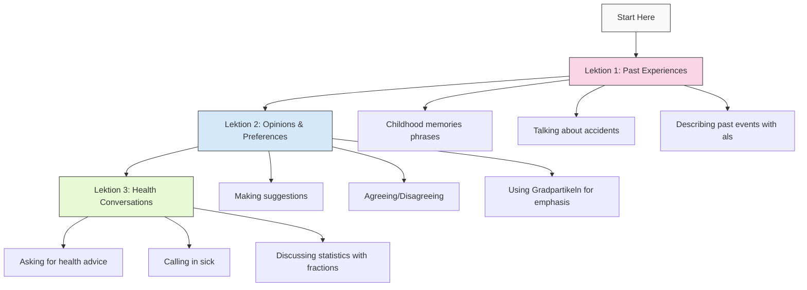
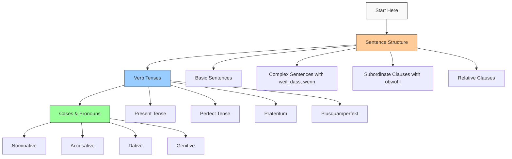
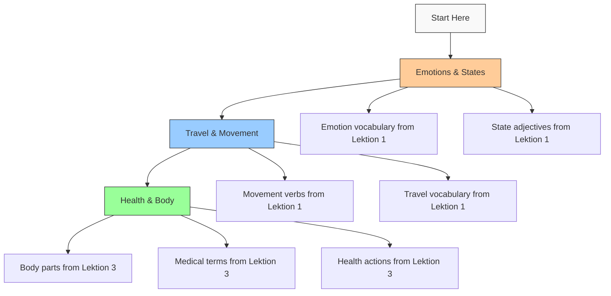
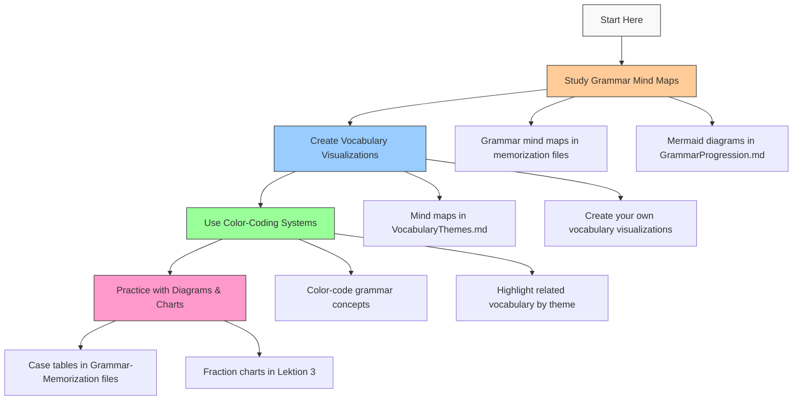
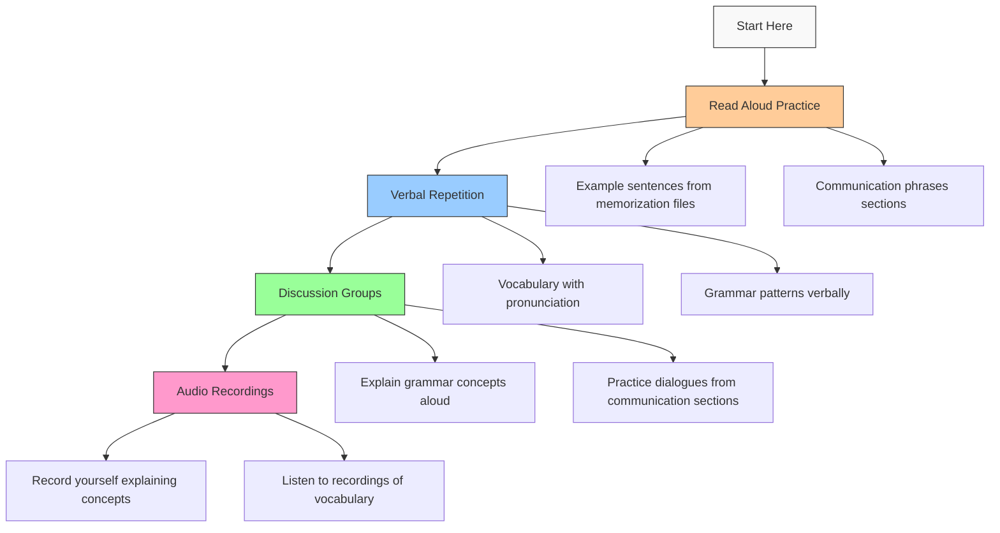
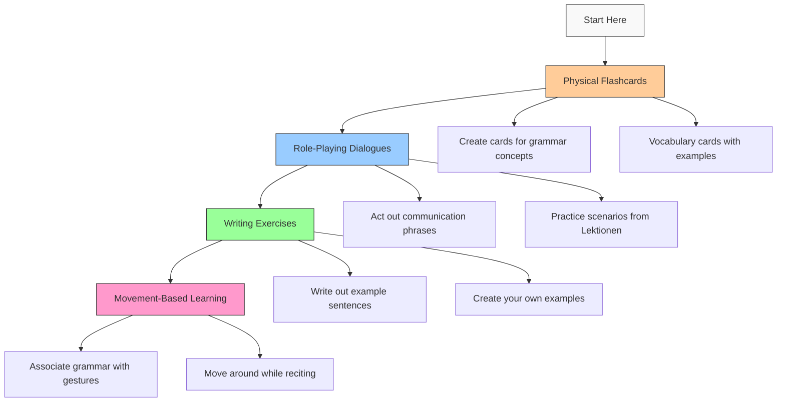
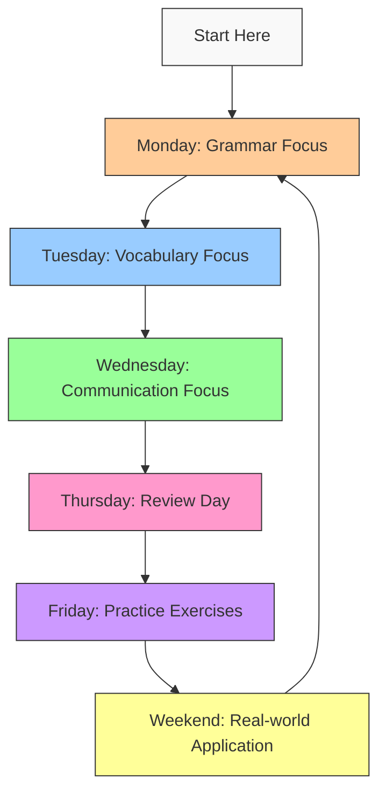
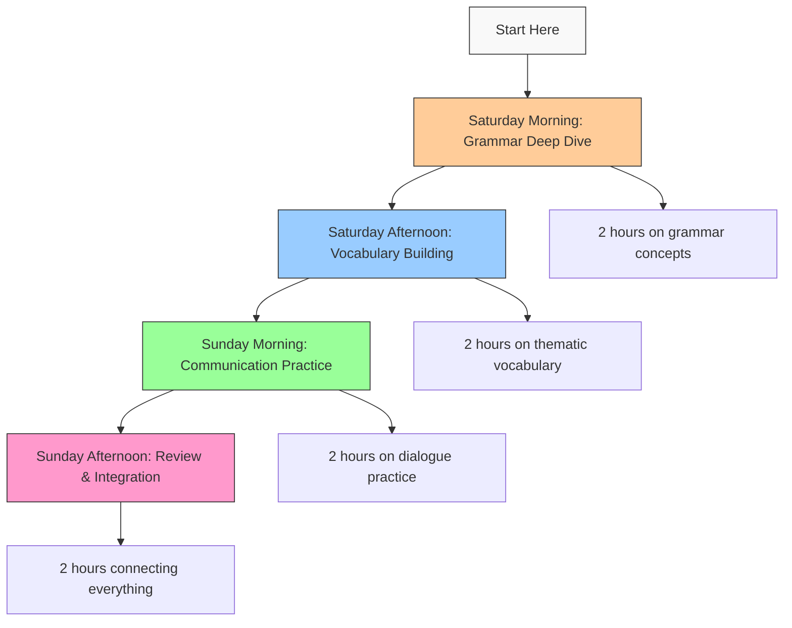
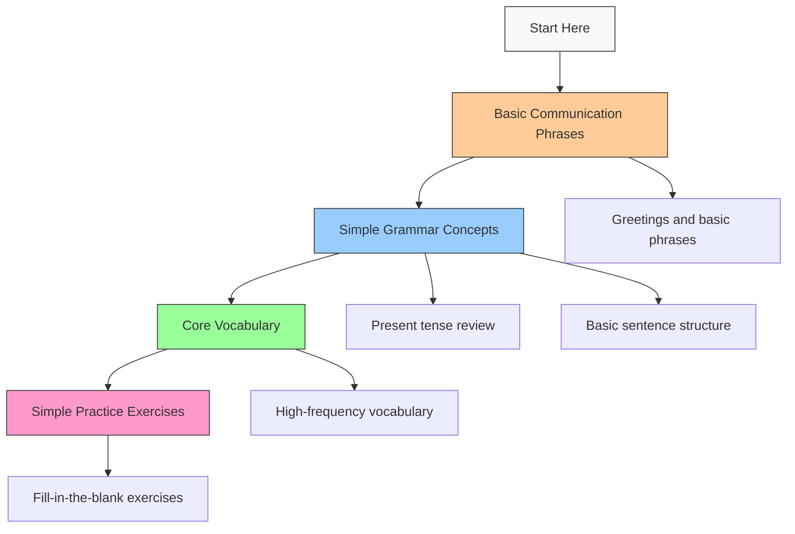
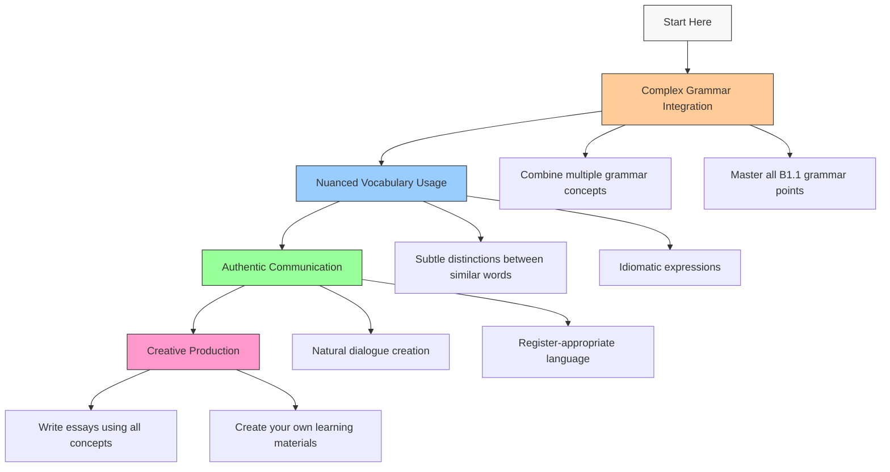

# German Learning Pathways 🛤️

This file provides structured learning routes through your German materials based on different goals and learning preferences. Each pathway offers a clear sequence to follow, helping you navigate your learning materials efficiently.

## Table of Contents
- [Goal-Based Pathways](#goal-based-pathways)
- [Learning Style Pathways](#learning-style-pathways)
- [Time-Based Pathways](#time-based-pathways)
- [Difficulty-Based Pathways](#difficulty-based-pathways)
- [Practical Application](#practical-application)
- [Progress Tracking](#progress-tracking)

## Goal-Based Pathways

### Conversation Skills Focus



#### Weekly Plan for Conversation Skills
1. **Week 1**: Lektion 1 - Past Experiences
   - Day 1-2: Learn childhood memory phrases
   - Day 3-4: Practice talking about accidents
   - Day 5-7: Master using "als" for past events

2. **Week 2**: Lektion 2 - Opinions & Preferences
   - Day 1-2: Learn phrases for making suggestions
   - Day 3-4: Practice agreeing and disagreeing
   - Day 5-7: Use Gradpartikeln to express opinions

3. **Week 3**: Lektion 3 - Health Conversations
   - Day 1-2: Learn phrases for asking health advice
   - Day 3-4: Practice calling in sick professionally
   - Day 5-7: Discuss statistics using fractions

### Grammar Mastery Focus



#### Monthly Plan for Grammar Mastery
1. **Month 1**: Sentence Structure
   - Week 1: Review basic sentences
   - Week 2: Complex sentences with weil, dass, wenn
   - Week 3: Subordinate clauses with obwohl (Lektion 2)
   - Week 4: Relative clauses with Relativpronomen (Lektion 2)

2. **Month 2**: Verb Tenses
   - Week 1: Review present tense
   - Week 2: Perfect tense review
   - Week 3: Präteritum (Lektion 1)
   - Week 4: Plusquamperfekt (Lektion 1)

3. **Month 3**: Cases & Pronouns
   - Week 1: Review nominative & accusative
   - Week 2: Review dative
   - Week 3: Genitive case (Lektion 3)
   - Week 4: Relative pronouns (Lektion 2)

### Vocabulary Expansion Focus



#### Biweekly Plan for Vocabulary Expansion
1. **Weeks 1-2**: Emotions & States (Lektion 1)
   - Learn 5-7 words per day
   - Group by semantic categories
   - Practice with example sentences
   - Create flashcards with context

2. **Weeks 3-4**: Travel & Movement (Lektion 1)
   - Learn 5-7 words per day
   - Focus on verb forms and usage
   - Practice with travel scenarios
   - Create mind maps of related words

3. **Weeks 5-6**: Health & Body (Lektion 3)
   - Learn 5-7 words per day
   - Group by medical contexts
   - Practice with doctor-patient dialogues
   - Create vocabulary lists by subtopic

## Learning Style Pathways

### Visual Learner Path



#### Visual Learning Activities
1. **Study existing visualizations**:
   - Grammar mind maps in memorization files
   - Mermaid diagrams in GrammarProgression.md
   - Mind maps in VocabularyThemes.md

2. **Create your own visualizations**:
   - Draw connections between related concepts
   - Create color-coded flashcards
   - Make your own mind maps for vocabulary themes

3. **Use visual memory techniques**:
   - Associate grammar rules with images
   - Visualize scenarios for vocabulary words
   - Create mental pictures for abstract concepts

### Auditory Learner Path



#### Auditory Learning Activities
1. **Read aloud practice**:
   - Example sentences from memorization files
   - Communication phrases sections
   - Grammar explanations

2. **Verbal repetition**:
   - Repeat vocabulary words with pronunciation
   - Recite grammar patterns verbally
   - Practice communication phrases aloud

3. **Discussion and explanation**:
   - Explain grammar concepts in your own words
   - Practice dialogues from communication sections
   - Teach concepts to someone else (or pretend to)

4. **Audio recordings**:
   - Record yourself explaining concepts
   - Record vocabulary lists and listen to them
   - Create audio flashcards

### Kinesthetic Learner Path



#### Kinesthetic Learning Activities
1. **Physical flashcards**:
   - Create tangible cards for grammar concepts
   - Make vocabulary cards with examples
   - Sort and organize cards physically

2. **Role-playing dialogues**:
   - Act out communication phrases
   - Practice scenarios from Lektionen
   - Use gestures and movement in conversations

3. **Writing exercises**:
   - Write out example sentences by hand
   - Create your own examples for each concept
   - Rewrite notes in your own words

4. **Movement-based learning**:
   - Associate grammar concepts with specific gestures
   - Move around the room while reciting vocabulary
   - Use physical objects to represent abstract concepts

## Time-Based Pathways

### 15-Minute Daily Sessions



#### 15-Minute Daily Plan
1. **Monday**: Grammar Focus (15 min)
   - Study one grammar concept from GrammarProgression.md
   - Review 2-3 example sentences
   - Try creating 1 new example

2. **Tuesday**: Vocabulary Focus (15 min)
   - Learn 5-7 new words from VocabularyThemes.md
   - Group them by theme
   - Create quick associations

3. **Wednesday**: Communication Focus (15 min)
   - Practice 3-5 communication phrases
   - Create a mini-dialogue using them
   - Focus on pronunciation

4. **Thursday**: Review Day (15 min)
   - Review Monday's grammar concept
   - Review Tuesday's vocabulary
   - Review Wednesday's phrases

5. **Friday**: Practice Exercises (15 min)
   - Complete 1-2 exercises from memorization files
   - Check your answers
   - Note any difficulties

6. **Weekend**: Real-world Application (15 min)
   - Try using what you've learned in a real context
   - Write a short paragraph using the week's material
   - Record yourself speaking for 1-2 minutes

### Weekend Intensive Study



#### Weekend Intensive Plan
1. **Saturday Morning**: Grammar Deep Dive (2 hours)
   - Study one major grammar concept in depth
   - Work through all examples in Grammar-Memorization files
   - Create your own examples and practice exercises
   - Review related concepts in GrammarProgression.md

2. **Saturday Afternoon**: Vocabulary Building (2 hours)
   - Focus on one thematic group from VocabularyThemes.md
   - Learn 20-30 words with examples and context
   - Create flashcards or mind maps
   - Practice using words in sentences

3. **Sunday Morning**: Communication Practice (2 hours)
   - Study communication phrases from one Lektion
   - Create dialogues using these phrases
   - Practice speaking aloud or with a partner
   - Role-play different scenarios

4. **Sunday Afternoon**: Review & Integration (2 hours)
   - Connect grammar concepts with vocabulary
   - Create sentences using both
   - Review everything learned over the weekend
   - Plan what to focus on next weekend

## Difficulty-Based Pathways

### Beginner-Friendly Route



#### Beginner Focus Areas
1. **Basic Communication Phrases**:
   - Greetings and introductions
   - Simple questions and answers
   - Basic expressions from communication sections

2. **Simple Grammar Concepts**:
   - Review of present tense
   - Basic sentence structure
   - Simple conjunctions (und, oder, aber)

3. **Core Vocabulary**:
   - High-frequency words from VocabularyThemes.md
   - Basic nouns, verbs, and adjectives
   - Words with clear English cognates

4. **Simple Practice Exercises**:
   - Fill-in-the-blank exercises
   - Matching activities
   - Simple translations

### Advanced Challenge Route



#### Advanced Challenge Activities
1. **Complex Grammar Integration**:
   - Combine multiple grammar concepts in single sentences
   - Master all B1.1 grammar points from GrammarProgression.md
   - Create complex sentences with multiple clauses

2. **Nuanced Vocabulary Usage**:
   - Focus on subtle distinctions between similar words
   - Learn and use idiomatic expressions
   - Expand vocabulary within specialized domains

3. **Authentic Communication**:
   - Create natural-sounding dialogues
   - Practice register-appropriate language
   - Develop fluency in specific scenarios

4. **Creative Production**:
   - Write essays using all concepts learned
   - Create your own learning materials
   - Develop original content using B1.1 grammar and vocabulary

## Practical Application

### Real-World Usage Scenarios

1. **Travel Scenario**:
   - Vocabulary: Travel & Movement theme
   - Grammar: Präteritum for storytelling
   - Communication: Describing past experiences
   - Practice: Create a travel narrative using past tenses

2. **Health Appointment**:
   - Vocabulary: Health & Body theme
   - Grammar: Passive with modal verbs
   - Communication: Health conversation phrases
   - Practice: Role-play a doctor's appointment

3. **Social Gathering**:
   - Vocabulary: Emotions & States theme
   - Grammar: Relativpronomen for descriptions
   - Communication: Making suggestions, agreeing/disagreeing
   - Practice: Describe people and make plans in a social context

4. **Work Environment**:
   - Vocabulary: Professional terms
   - Grammar: Formal structures and passive voice
   - Communication: Calling in sick, making requests
   - Practice: Write professional emails and practice workplace dialogues

### Integration Exercises

1. **Theme-Based Integration**:
   - Choose one theme from VocabularyThemes.md
   - Identify grammar concepts that work well with this theme
   - Find communication phrases related to the theme
   - Create a complete scenario integrating all three elements

2. **Grammar-Focused Integration**:
   - Select one grammar concept from GrammarProgression.md
   - Find vocabulary that works well with this grammar
   - Identify situations where this grammar would be used
   - Create practice exercises combining all elements

3. **Communication-Centered Integration**:
   - Choose a communication scenario from a Lektion
   - Identify grammar needed for this type of communication
   - List vocabulary essential for this context
   - Role-play the scenario using all components

## Progress Tracking

### Learning Journal Template

```
# German Learning Journal - [Date]

## Today's Focus
- Grammar: [Concept studied]
- Vocabulary: [Words/theme studied]
- Communication: [Phrases practiced]

## What I Learned
- [New insights or understanding]
- [Connections made to previous knowledge]
- [Difficult points to remember]

## Practice Completed
- [Exercises done]
- [Real-world application attempted]
- [Time spent on each activity]

## Questions/Challenges
- [Points that need clarification]
- [Difficulties encountered]
- [Areas needing more practice]

## Next Steps
- [What to focus on next]
- [Review needed]
- [Goals for next session]
```

### Progress Checklist

Create a checklist for each Lektion to track your mastery:

#### Lektion 1 Checklist
- [ ] Grammar: Präteritum
  - [ ] Regular verbs
  - [ ] Irregular verbs
  - [ ] Mixed verbs
- [ ] Grammar: als (when)
  - [ ] Distinguish from wenn
  - [ ] Correct word order
- [ ] Grammar: Plusquamperfekt
  - [ ] Formation with haben
  - [ ] Formation with sein
- [ ] Vocabulary: Experiences & Events
- [ ] Vocabulary: Travel & Movement
- [ ] Vocabulary: States & Conditions
- [ ] Communication: Talking about childhood
- [ ] Communication: Describing accidents
- [ ] Communication: Talking about lucky charms

#### Lektion 2 Checklist
- [ ] Grammar: obwohl (although)
  - [ ] Correct word order
  - [ ] Contrast with trotzdem
- [ ] Grammar: Relativpronomen
  - [ ] Nominative forms
  - [ ] Accusative forms
  - [ ] Dative forms
- [ ] Grammar: Gradpartikeln
  - [ ] Positive intensifiers
  - [ ] Negative intensifiers
- [ ] Communication: Talking about preferences
- [ ] Communication: Making suggestions
- [ ] Communication: Agreeing/disagreeing

#### Lektion 3 Checklist
- [ ] Grammar: Passiv mit Modalverben
  - [ ] Formation
  - [ ] Usage contexts
- [ ] Grammar: Genitiv
  - [ ] Articles
  - [ ] Noun endings
  - [ ] Possessive forms
- [ ] Grammar: Bruchzahlen
  - [ ] Basic fractions
  - [ ] Usage in statistics
- [ ] Vocabulary: Health & Body
- [ ] Vocabulary: Medical Actions
- [ ] Communication: Asking for health advice
- [ ] Communication: Giving advice
- [ ] Communication: Calling in sick

### Spaced Repetition Schedule

For optimal retention, follow this review schedule:

1. **Day 1**: Initial learning
2. **Day 2**: First review (24 hours later)
3. **Day 4**: Second review (3 days after initial learning)
4. **Day 7**: Third review (1 week after initial learning)
5. **Day 14**: Fourth review (2 weeks after initial learning)
6. **Day 30**: Fifth review (1 month after initial learning)
7. **Day 90**: Sixth review (3 months after initial learning)

Apply this schedule to grammar concepts, vocabulary themes, and communication phrases for maximum retention.
