# German Vocabulary Thematic Connections 📚

This file organizes vocabulary from all Lektionen by theme, helping you see connections between related words regardless of which lesson they appear in.

## Table of Contents
- [Emotions & Feelings](#emotions--feelings)
- [Travel & Movement](#travel--movement)
- [Health & Body](#health--body)
- [States & Conditions](#states--conditions)
- [Communication & Media](#communication--media)
- [Time & Sequence](#time--sequence)
- [Quantities & Measurements](#quantities--measurements)
- [Learning Strategies](#learning-strategies)

## Emotions & Feelings

```mermaid
mindmap
  root((Emotions))
    Positive
      der Mut #L1
      verliebt sein #L1
      aufregend #L1
      witzig #L1
    Negative
      der Ärger #L1
      erschöpft #L3
      stressig #L3
    Surprise
      die Überraschung #L1
      verrückt #L1
```

### Emotion Vocabulary List

| German | English | Lektion | Notes |
|--------|---------|---------|-------|
| der Mut (Sg.) | courage | #L1 | Used in "den Mut haben" (to have the courage) |
| der Ärger (Sg.) | anger/trouble | #L1 | "Ärger haben" = to have trouble |
| die Überraschung, -en | surprise | #L1 | |
| verliebt sein | to be in love | #L1 | State verb |
| aufregend | exciting | #L1 | Describes experiences |
| witzig | funny | #L1 | Describes people or situations |
| verrückt | crazy | #L1 | Can be positive or negative |
| erschöpft | exhausted | #L3 | Related to stress and health |
| stressig | stressful | #L3 | Describes situations or jobs |

### Emotion Connections

- **Stress-related**: erschöpft, stressig (L3) → connected to health vocabulary
- **Positive feelings**: Mut, verliebt sein, aufregend, witzig (L1)
- **Reaction words**: Überraschung, Ärger (L1) → often used to describe responses to events

## Travel & Movement

### Movement Vocabulary List

| German | English | Lektion | Notes |
|--------|---------|---------|-------|
| steigen (in) | to board/get in | #L1 | Used with transportation |
| erreichen | to reach | #L1 | Goal-oriented movement |
| fliehen | to flee | #L1 | Movement away from danger |
| verschwinden | to disappear | #L1 | Related to weg sein |
| weg sein | to be gone | #L1 | State of absence |
| folgen | to follow | #L1 | Movement in relation to others |
| das Mittelmeer (Sg.) | the Mediterranean | #L1 | Travel destination |

### Movement Connections

- **Directional verbs**: steigen, fliehen, folgen (L1)
- **Absence verbs**: verschwinden, weg sein (L1)
- **Goal verbs**: erreichen (L1)

## Health & Body

### Health Vocabulary List

| German | English | Lektion | Notes |
|--------|---------|---------|-------|
| der Magen, - | stomach | #L3 | Body part |
| das Mittel, - | remedy/means | #L3 | General term for medicine |
| der Schlaf (Sg.) | sleep | #L3 | Essential body function |
| der Faktor, -en | factor | #L3 | Used in health discussions |
| die Wirkung, -en | effect | #L3 | Of medicine or treatment |
| die Kraft, -e | strength/power | #L3 | Physical or mental |
| der Mangel, - | deficiency/lack | #L3 | Often with Schlafmangel (lack of sleep) |
| das Schmerzmittel, - | painkiller | #L3 | Specific type of medicine |
| die Schulter, -n | shoulder | #L3 | Body part |
| messen | to measure | #L3 | Medical action (blood pressure, etc.) |
| untersuchen | to examine | #L3 | Medical action |
| verschreiben | to prescribe | #L3 | Doctor's action |
| impfen | to vaccinate | #L3 | Preventive medical action |
| krank-melden | to call in sick | #L3 | Work-related health term |
| krankschreiben | to write off sick | #L3 | Doctor's administrative action |

### Health Connections

- **Body parts**: Magen, Schulter (L3)
- **Medical professionals' actions**: untersuchen, verschreiben, krankschreiben (L3)
- **Patient actions**: krank-melden, impfen lassen (L3)
- **Conditions**: Schlaf, Mangel, Kraft (L3)

## States & Conditions

```mermaid
mindmap
  root((States))
    Physical States
      betrunken #L1
      tief #L1
    Character Traits
      mutig #L1
      witzig #L1
    Temporary States
      weg sein #L1
      verliebt sein #L1
    Health States
      erschöpft #L3
      stressig #L3
```

### States Vocabulary List

| German | English | Lektion | Notes |
|--------|---------|---------|-------|
| weg sein | to be gone | #L1 | Temporary absence |
| verrückt | crazy | #L1 | Can describe people or situations |
| mutig | brave | #L1 | Character trait |
| tief | deep | #L1 | Physical description |
| einig | agreed | #L1 | State of agreement |
| betrunken | drunk | #L1 | Temporary state |
| aufregend | exciting | #L1 | Quality of an experience |
| witzig | funny | #L1 | Quality of person or situation |
| verliebt sein | to be in love | #L1 | Emotional state |
| erschöpft | exhausted | #L3 | Physical state from stress/work |
| stressig | stressful | #L3 | Quality of a situation |

### States Connections

- **Character descriptions**: mutig, witzig, verrückt (L1)
- **Temporary conditions**: betrunken, verliebt sein, weg sein (L1)
- **Health-related states**: erschöpft (L3) - connects to health vocabulary
- **Environmental qualities**: aufregend, stressig (L1, L3)

## Communication & Media

```mermaid
mindmap
  root((Communication))
    News
      die Meldung #L1
      die Überschrift #L1
      der Artikel #L1
    Conversation
      die Stimme #L1
      das Gespräch #L1
    Information
      die Angabe #L1
      die Information #L1
      der Bericht #L1
    Professional
      die Konferenz #L3
```

### Communication Vocabulary List

| German | English | Lektion | Notes |
|--------|---------|---------|-------|
| die Meldung, -en | news item | #L1 | Media term |
| die Überschrift, -en | headline | #L1 | Newspaper/article part |
| der Artikel, - | article | #L1 | Written piece |
| die Stimme, -n | voice | #L1 | Spoken communication |
| die Angabe, -n | information | #L1 | Factual details |
| das Gespräch, -e | conversation | #L1 | Between people |
| der Bericht, -e | report | #L1 | Formal communication |
| die Information, -en | information | #L1 | General knowledge |
| die Anzeige, -n | advertisement | #L1 | Commercial communication |
| die Konferenz, -en | conference | #L3 | Professional gathering |

### Communication Connections

- **Written media**: Meldung, Überschrift, Artikel, Bericht (L1)
- **Spoken communication**: Stimme, Gespräch (L1)
- **Information sharing**: Angabe, Information (L1)
- **Professional communication**: Konferenz (L3)

## Time & Sequence

```mermaid
mindmap
  root((Time))
    Past Markers
      als #L1
    Frequency
      nachts #L3
      öfter #L3
    Sequence
      zunächst #L3
      gleichzeitig #L3
    Time of Day
      die Mitternacht #L1
```

### Time Vocabulary List

| German | English | Lektion | Notes |
|--------|---------|---------|-------|
| während | while | #L1 | During an action |
| als | when (one-time) | #L1 | For single past events |
| die Mitternacht (Sg.) | midnight | #L1 | Specific time |
| nachts | at night | #L3 | Regular time period |
| öfter | more often | #L3 | Frequency |
| gleichzeitig | simultaneously | #L3 | Timing relationship |
| zunächst | first/initially | #L3 | Sequence marker |

### Time Connections

- **Temporal conjunctions**: während, als (L1)
- **Time periods**: nachts, Mitternacht (L3, L1)
- **Sequence markers**: zunächst, gleichzeitig (L3)
- **Frequency**: öfter (L3)

## Quantities & Measurements

### Quantities Vocabulary List

| German | English | Lektion | Notes |
|--------|---------|---------|-------|
| die Hälfte, -n | half | #L3 | Fraction (1/2) |
| das Viertel, - | quarter | #L3 | Fraction (1/4) |
| das Drittel, - | third | #L3 | Fraction (1/3) |
| das Gewicht (Sg.) | weight | #L3 | Measurement |
| ausreichend | sufficient | #L3 | Quantity descriptor |
| ideal | ideal | #L3 | Optimal amount |

### Quantity Connections

- **Fractions**: Hälfte, Viertel, Drittel (L3) - used in statistics
- **Measurements**: Gewicht (L3) - related to health
- **Sufficiency markers**: ausreichend, ideal (L3)

## Learning Strategies

### Vocabulary Learning by Theme

1. **Group by semantic field**: Study words that belong to the same theme together
   - Example: Learn all health-related words from Lektion 3 as a group

2. **Create word families**: Connect words with the same root
   - Example: krank → krank-melden → krankschreiben

3. **Visualize connections**: Use the mind maps in this document to see how words relate

4. **Learn in opposites**: Pair contrasting words
   - Example: mutig (brave) ↔ ängstlich (fearful)

### Memory Techniques

1. **Word association**: Connect German words to similar-sounding English words
   - Example: "Magen" (stomach) sounds a bit like "my gut"

2. **Visualization**: Create mental images for abstract words
   - Example: For "Überraschung" (surprise), imagine a birthday present

3. **Contextual learning**: Learn words in phrases or sentences
   - Example: "Ich habe Magenschmerzen" instead of just "Magen"

4. **Categorization**: Organize vocabulary by grammatical features
   - Example: Group all masculine nouns, or all strong verbs

### Practice Exercises

1. **Theme mapping**: Create your own mind maps for vocabulary themes
2. **Cloze sentences**: Fill in missing theme-related words in sentences
3. **Word association chains**: Connect words within a theme
4. **Thematic storytelling**: Create short stories using words from one theme
5. **Cross-theme connections**: Find words that connect multiple themes
